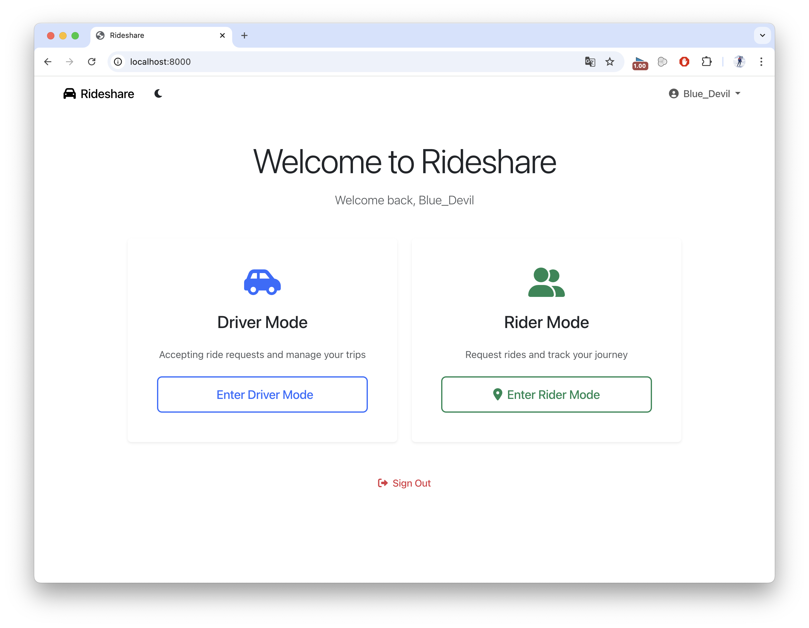

# Ride Sharing Service

A platform for ride-sharing, developed as part of the **ERSS (Engineering of Reliable Software Systems)** course at **Duke University**.



## Features

- **Driver & Rider Roles** — Register as a driver to offer rides, or as a rider to request or join a shared ride.
- **Ride Requests** — Riders create ride requests with pickup/drop-off locations, passenger count, arrival time, and optional vehicle type preference.
- **Ride Sharing** — Riders can search for and join existing rides headed in their direction; route optimization via Google Maps Directions API.
- **Driver Dashboard** — Drivers see matching open ride requests filtered by vehicle capacity and special requirements.
- **Email Notifications** — Riders receive an email when a driver accepts their ride (via Gmail API).
- **Profile Management** — Users can update their profile and change their password.
- **Dark Mode** — System-aware dark/light theme toggle.

## Tech Stack

- **Backend**: Django 5.1, PostgreSQL
- **Frontend**: Bootstrap 5, SweetAlert2
- **APIs**: Google Maps Distance Matrix & Directions API, Gmail API (OAuth2)
- **Infrastructure**: Docker, Docker Compose, Nginx

## Prerequisites

- Docker and Docker Compose
- A `.env` file with required secrets (see below)
- Google Maps API key enabled for Distance Matrix and Directions APIs
- Gmail OAuth2 credentials for email notifications (optional)

## Setup

### 1. Clone the repository

```bash
git clone <repo-url>
cd ride-sharing-service-webapp
```

### 2. Create a `.env` file

Create `docker-deploy/web-app/.env` with the following variables:

```env
DJANGO_SECRET_KEY=your-secret-key-here
DJANGO_DEBUG=False

POSTGRES_DB=postgres
POSTGRES_USER=postgres
POSTGRES_PASSWORD=your-db-password

GOOGLE_MAPS_API_KEY=your-google-maps-api-key

EMAIL_HOST_USER=your-gmail@gmail.com
EMAIL_HOST_PASSWORD=your-app-password
```

> Do **not** commit the `.env` file. It is already listed in `.gitignore`.

### 3. (Optional) Set up Gmail OAuth2

Email notifications use the Gmail API with OAuth2:

1. Download `credentials.json` from Google Cloud Console (OAuth2 Desktop client)
2. Place it in `docker-deploy/web-app/`
3. Run once locally to generate a token:
   ```bash
   cd docker-deploy/web-app
   python gmail_token.py
   ```
4. The generated `token.json` stays in the same directory (do **not** commit it)

### 4. Start the application

```bash
cd docker-deploy
docker-compose up --build
```

The app will be available at [http://localhost:8000](http://localhost:8000).

### 5. Stop the application

```bash
docker-compose down
```

To also remove the database volume:

```bash
docker-compose down -v
```

## Project Structure

```
docker-deploy/
  web-app/
    accounts/             # User registration, login, profile
    rider/                # Ride requests, sharing, dashboard
    driver/               # Driver registration, ride acceptance
    utils/                # Gmail API helper
    rideshare_project/    # Django project settings and URLs
    templates/            # Base HTML templates
    static/               # Static assets
  nginx/                  # Nginx reverse proxy config
  docker-compose.yml
```

## Environment Variables Reference

| Variable | Description | Default |
|----------|-------------|---------|
| `DJANGO_SECRET_KEY` | Django secret key | insecure dev key |
| `DJANGO_DEBUG` | Enable debug mode | `True` |
| `POSTGRES_DB` | Database name | `postgres` |
| `POSTGRES_USER` | Database user | `postgres` |
| `POSTGRES_PASSWORD` | Database password | `postgres` |
| `GOOGLE_MAPS_API_KEY` | Google Maps API key | — |
| `EMAIL_HOST_USER` | Gmail address | — |
| `EMAIL_HOST_PASSWORD` | Gmail app password | — |

## Known Limitations

- Each ride can only have one sharer.
- A driver cannot switch to rider mode while carrying a passenger (and vice versa) — not yet enforced.
- Time zone selection for users is not yet implemented.
