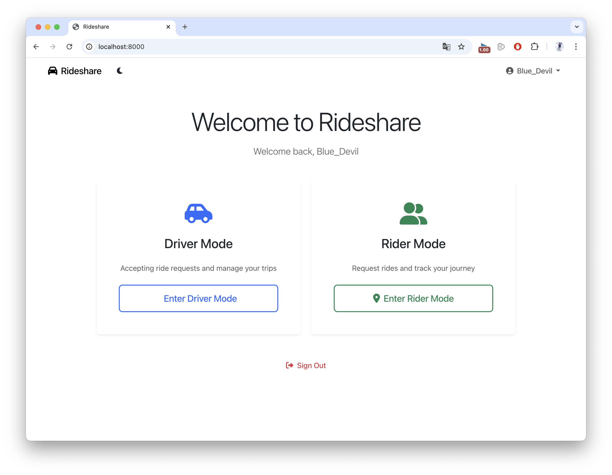

# Duke-Duber (erss-hwk1-jh730-xs90)

This is a platform for ride-sharing, developed as part of the **ERSS (Engineering of Reliable Software Systems)** course at **Duke University**.

Note that we have

## What's New

### 2025-02-07
- We stored the credetials.json and token.js in our local working environment and put them in the gitignore.
- Email registration implemented
- Store user emails in the database
- Send email notifications when a ride is accepted

### 2025-02-03
- Users can only modify existing ride requests and view ride history; they can no longer initiate new ride requests.
- Users can now see detailed information about their past rides.
- **Notes (Limitations):**  
  - Each ride can only have one sharer (this restriction is not yet implemented).  
  - When ride-sharing is enabled, the route follows this order:  
    **Initiator → Passenger pickup point → (Passenger drop-off point, Initiator’s destination)**.  
    The last two steps can be adjusted for optimal route efficiency, but all drop-off times must remain within the passengers’ allowed time windows.

## Danger Log / TODO  

### **Feb 6**  

#### **Must Do**  
- [X] Fix crashes caused by incorrect input from the sharer (add error handling).  
- [X] Adjust the sharer/requester passenger count display, as it currently appears inconsistent (though the actual count validation happens elsewhere).  
- [X] Ensure that drivers only see ride requests that match their criteria.  
- [X] Ride information display is incomplete; possible solutions:  
  1. Add a **"View Details"** function.  
  2. Display all ride details directly.  

#### **Optional**  
- [ ] Users with an active ride (as either a sharer or requester) should not be able to act as a driver.  
      If they try, show a message: *"You have an ongoing ride. Please cancel it before switching roles."*  
- [X] Review the **Danger Log** and **TODO List** for any overlooked issues. Also, translate remaining Chinese notes.  
- [X] Test UI responsiveness across different browsers, window sizes, and devices (mobile, desktop, etc.).  

### **Feb 4**  

#### **Must Do**  
- [X] The ride modification page should have a similar layout to the ride request page.  
- [X] Add a unique ID for each ride request.  
- [X] Allow users to cancel their ride requests.  

### **Feb 3**  

#### **Must Do**  
- [ ] A driver cannot switch to rider mode while carrying a passenger, and vice versa.  
- [X] Clicking on a ride should display full details (driver, sharer, etc.).  
- [X] Each ride should have only one sharer (restriction not yet implemented).  
- [X] The initiator’s latest arrival time must be later than the modification time + estimated travel time + 1 minute.  
- [X] A sharer should be able to leave a shared ride and search for another one.  
- [X] Once a sharer confirms a ride, their dashboard should resemble the initiator’s,  
      but clicking **"Modify Ride"** should redirect them to the ride search page instead.  

### **Feb 1**  

#### **Must Do**  
- [X] Add `.gitignore` file for `__pycache__` and `.vscode`.  
- [X] Allow non-standard pickup and drop-off locations.  
- [X] Prevent excessively large passenger counts.  
- [X] Ensure pickup date and time are not in the past.  
- [X] Implement ride-sharing option.  
- [X] Allow users to select an optional vehicle type.  
- [X] Add arrival date and time.    
- [X] The ride owner can modify an active ride.  
- [X] On the main dashboard, only a summary of rides should be displayed. Clicking on a ride should show more details.  
- [X] Allow drivers to update their vehicle information.  
- [X] Restrict drivers to accepting only one ride at a time.  
- [X] Allow drivers to view their ride history.  
- [X] Allow drivers to see ride details.  
- [X] Enable drivers to mark a ride as **"finished."**  
- [X] Ensure drivers can only select rides that match their vehicle type.  

#### **Optional**  
- [ ] Implement time zone selection for users.  
- [X] Allow users to update their profile and password.  
- [X] Require users to fill in mandatory fields before proceeding.  